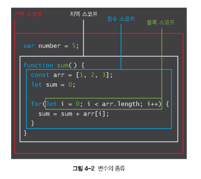

# javaScript 중간고사 이론 정리


## 1. 개론

> 시험에 나올지는 모르겠지만 혹시 모르니까 정리해놓자.


### 1.1 인터넵과 웹의 차이는?


1. 공통점

    연결(connection)
    - 유션이나 무선으로 연결된 통신 회선을 따라 문자, 이미지, 음악, 동영상등으로 구성된 웹페이지(콘텐츠)가 이동


2. 차이점

    인터넷(Internet)
    - 컴퓨터와 컴퓨터를 연결하는 네트워크(network)
    - 보통 컴퓨터를 노드(node)라고 하고 유선이나 무선으로 노드끼리 연결하는 물리적이ㅏㄴ 연결망
    - 예시: 여러 도시를 연결하는 철로, 도로

    웹(web)
    - 콘텐츠(웹페이지)와의 연결
    - 인터넷을 통한 문자, 이미지, 소리, 동영상등을 전동되어 브라우저로 그 정보를 접근


### 1.2 역할과 규칙


1. 서버와 클라이언트

    클라이언트(client)
    - 서비스를 요청(request)하는 역할
    
    서버(server)
    - 요청된 서비스에 대하여 응(response)하는 역할


2. 정적(static) 웹페이지

    미리 만들어 놓은 웹페이지
    - 예시 : 편의점의 김밥
    - HTML + CSS + Javascript
    - 노동 집약적 웹페이지


3. 동적(dynamic) 웹페이지

    요청에 따라 프로그래밍으로 만들어지는 웹페이지
    - 예시 : 김밥전문점
    - 데이터베이스 또는 외부정보와 연결, 결합
    - JSP, PHP, ASP : 웹프로그래밍 언어


4. 프론트엔드(Front-end)

    - 시각적(브라우저)으로 표현되는 모든 콘텐츠 기술 분야
    - HTML, CSS, Javascript, 이미지, 동영상, 소리 등
    - 웹디자이너, 웹퍼블리셔, 프론트엔드 개발자


5. 백엔드(Back-end)

    - 동전의 뒷면처럼 보이지 않는 서버쪽의 모든 기술분야
    - 서버 엔지니어, 데이터베이스 관리자
    - 백엔드 개발자


6. 풀스택(Full-stack)

    - 프론트엔드 + 백엔드
    - Node.js


7. 각각의 역할

    1. HTML
        - 웹페이지의 구조
    
    2. CSS
        - 웹페이지의 표현

    3. Javascript
        - 웹페이지의 행위
        - Event 처리


8. 웹 주소
    URL 형식
    - http://site.com:80/patch/page?a=1&b=2#hash 라는 주소로 알아보자

        1. http => 프로토콜(protocol)
            - 인터넷의 웹 자원을 요청/ 응답하기 위한 규칙과 절차
        
        2. site.com => 호스트명(hostname)
            - 웹 자원을 갖는 특정 서버의 이름(식별자)
        
        3. 80 = 포트(prot)
            - 특정 서버로 전달하기 위한 방법 (여러가지 포트 번호가 있음 http : 80, https : 443)

        4. patch/page => 경로(pathname)
            - 서버 내에서 웹페이지가 있는 상세한 위치

        5. ?a=1&b=2 => 검색(search)
            - 동적 화면을 구성하기 위한 전달 변수
        
        6. #hash => 해시(hash)
            - 웹페이지 내에서의 특정한 위치(식별자)


### 1.3 도구와 기술의 종류 및 트랜드


1. 브라우저(Browser)

    - 구글 크롬 : 가장 높은 점유율
    - 애플 사파리, 마이크로소프트 엣지, 모질라 재단 파이어폭스
    - 네이버 웨일, 삼성인터넷 등


## 2. Javascript로 할 수 있는 일

> 자바는 기본적으로 인터프리터 언어라는 것만 알아두고 넘어가도 될듯?


-------------------------


## 3. Basic

> 본격적인 Javascript 코딩의 기초 이론이 들어있다.


-------------------------


### 1. 기본 용어


1. 표현식과 문장
    

    1. 표현식

        ```javascript
        273
        10 + 20 + 30 + * 2
        ```

        - 값을 만들어내는 코드 조각이다.

    2. 문장

        ```javascript
        let name = "장혁";
        console.log("Hello World...");
        ```

        - "명령"을 내리는 코드 단위이다.
        - 표현식이 하나 이상 모이면 문장이 됨
        - 문장 끝에는 반드시 **세미콜론(;)**을 써서 문장의 끝을 표기해야 한다.


    3. 프로그램

        ```javascript
        10 + 20 * 3 * 2;
        let name = "장혁";
        console.log("Hello World...");
        ```

        - 문장들이 모여 하나의 완전한 프로그램을 구성함.
    

2. 식별자(Identifier)


    1. 이름을 붙일 때 사용하는 단어, 변수와 함수 이름 등으로 사용

        - 키워드(keyword)는 사용 불가

        - 특수문자는 '**_**' 와 '**$**' 만 허용

        - 숫자로 시작하면 안됨

            ```javascript
            // 잘못된 예시
            123alpha

            // 올바른 예시
            alpha123
            ```

        - 공백은 입력 하면 안됨

            ```javascript
            // 잘못된 예시
            has space
             alpha

            // 올바른 예시
            hasspace
            has_space
            _alpha
            ```


    2. 식별자 사용 규칙

        - Class의 이름은 항상 **대문자**로 시작한다.

            ```javascript
            class Student { ... } // 올바른 예시
            class student { ... } // 잘못된 예시 (소문자 시작)
            ```
        

        - 변수, 함수, 속성, 메서드는 항상 **소문자**로 시작한다.

            ```javascript
            let name = "장혁"
            function getName() { ... }
            ```
        
        - 여러 단어를 조합할 땐 **두 번째 단어부터 첫 글자를 대문자**로 사용한다. (**camleCase**)

            ```javascript
            let myName = "장혁" // myName
            function getNameWhat() { ... } // getNameWhat
            ```
    

    3. 주석(Comment)

        프로그램의 진행에 영향을 주지 않는 코드이다.
        주로 설명할때 사용

        ```javascript
        // 이거는 한 줄만 유효
        아래 내려가면 이렇게 처리가 안 됨

        /*
        여러줄을 사용하려면 이거를 사용한다.
        마지막에 반대로 닫으면 끝
        */

        /**
         * 이거를 사용하면
         * 엔터를 사용할 때마다
         * 이렇게 별이 생겨서
         * 여러줄을 작성 할 수
         * 있다.
         */
        ```


### 2. 출력


1. 출력 메서드(method)

    - console 객체의 log() 메서드를 사용 : console.log() 메서드

        ```javascript
        console.log("문자열");
        ```

        출력결과
        ```
        문자열
        ```
    
    - REPL을 사용한 출력

        REPL은

        > **R**ead – 읽기
        **E**valuate – 평가(실행)
        **P**rint – 출력
        **L**oop – 반복

        의 약자다.
        즉, 명령을 입력하면 즉시 실행하고 결과를 출력하는 환경을 뚯한다.
        브라우저 콘솔(F12 → Console 탭)이나 Node.js 터미널이 대표적인 REPL 환경.

        따라서 곧바로 문장을 입력해서 출력함.
        ```javascript
        > "안녕" + "하세요"
        '안녕하세요'
        > 52 + 273
        325
        ```


### 3. 변수


1. 변수(Variables)란?

    0. named storage : 식별자(named) + 저장소(storage)
    
    1. 유효 범위

        - 전역 변수 (grobal variable) : 프로그램 전체에서 접근 가능
            
            ```javascript
            var num = 10;
            ```
        
        - 지역 변수 (local variable) : 함수나 블록 내부에서만 접근 가능

            ```javascript
            let x = 5;
            ```

        자바스크립트에는 다양한 스코프(scope)가 있는데

        - 전역 범위 (grobal scope)
        - 지역 범위 (local scope)
        - 함수 범위 (function scope)
        - 블록 범위 (block scope)

        var, let, const에 따라 스코프 범위가 달라진다.

        예시
        
    

    2. 값의 변화

        - 정적 변수 (stactic variable) : 직접 값을 할당한 변수. 고정된 값을 저장. 값이 바뀌지 않음.
        - 동적 변수 (dynamic variable) : 함수 등 연산의 결과로 값의 변경이 가능한 변수

        ```javascript
        let x = 10; // 직접 할당했으니 '정적'
        x = x + 5 // 함수 등 연산의 결과로 변경 되었으니 '동적'
        ```

    
    3. 값의 개수

        - 스칼라(scalar) 변수 : 하나의 변수에 하나의 값만 할당 '1:1'

            ```javascript
            let age = 26;
            ```

        - 오브젝트(object) 변수 : 하나의 변수에 여려개의 값 할당 가능 '1:N'

            ```javascript
            let whoAmI = { name : "장혁", age : 20};
            ```


2. 변수 실습


    1. 변수 선언하기